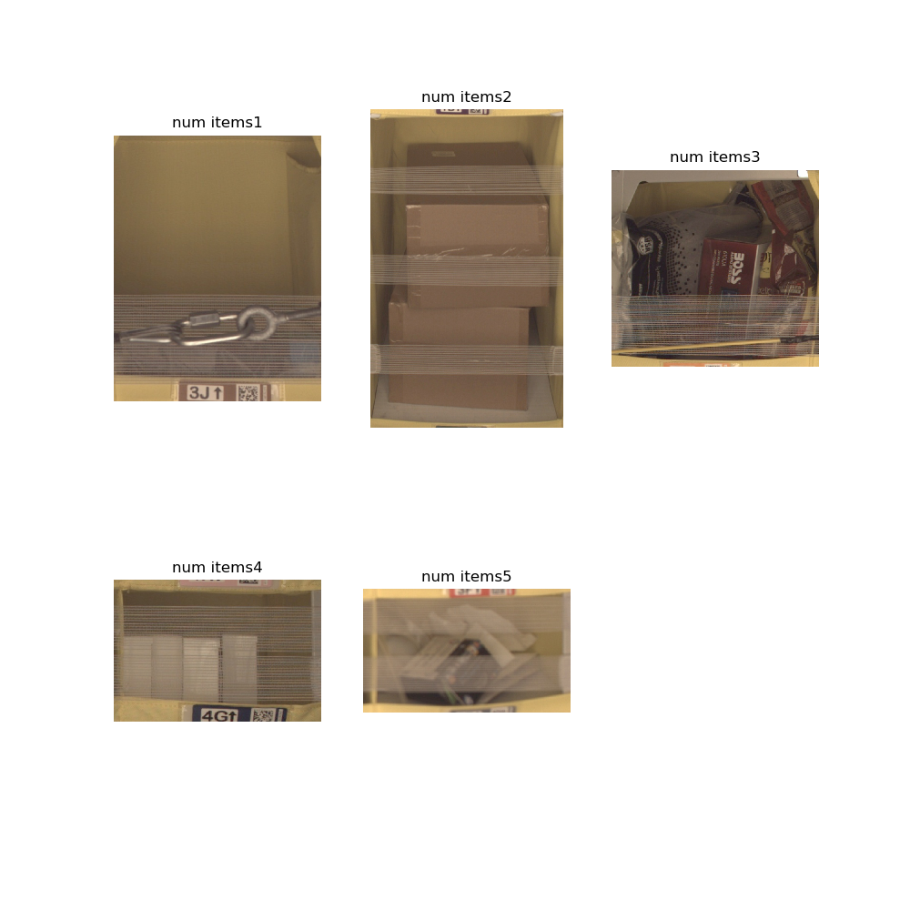
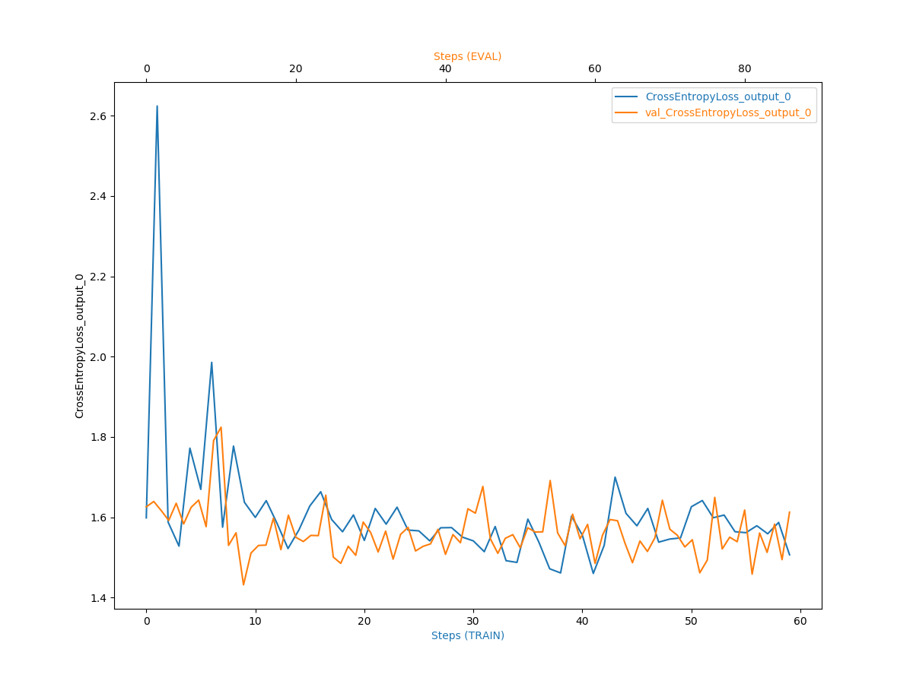
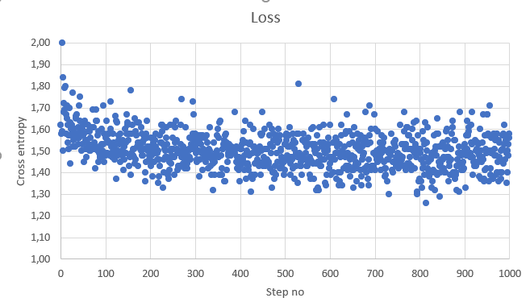
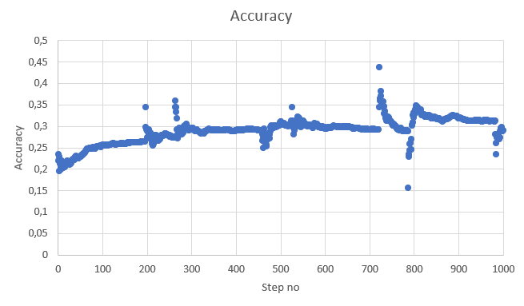

# Inventory Monitoring at Distribution Centers
Delivery and logistics systems are essential to many sectors of the economy today. The COVID-19 outbreak demonstrated the serious effects of even minor disruptions in the logistical system. As a result, large warehouses need automated systems that can sort and distribute goods based on a variety of factors, including delivery address and material type. In these warehouses, shipments and other products are typically transported in boxes, each of which can accommodate many items. The automated delivery system's job would be to categorize the package and choose where to deliver it. The system first has to know how many items are in each delivery box, and the proposed Capstone project will focus on that.

In order to count number of objects in a box I make use of [Amazon Bin Image Dataset](https://registry.opendata.aws/amazon-bin-imagery/), which contain photo of the box content and other objects' characteristics including number of objects. Based on this image the implemented solution will estimate number of objects. 

## Setup and Installation of the Project
The project is intended to run a single instance of AWS cloud services including S3, SageMaker, Lambda, and IAM. Please open an Amazon account and clone this repository into your SageMaker notebook instance in order to run the project's code correctly. All of the computing resources used for this project are included in the AWS cloud's free plan.
machines that are advised are

- for notebook: ml.t2.medium
- for training: ml.m5.large or ml.m5.xlarge
You can use different instance types for this project, but they might require additional permissions to the AWS cloud.

As AWS cloud is quickly developing and UI is evolving as I write this it is best to refer to [official AWS tutorial](https://docs.aws.amazon.com/sagemaker/latest/dg/howitworks-create-ws.html) for SageMaker instead providing my tutorial which might become outdated quickly. 

## Project files
Project consist of multiple files:
- [`sagemaker.ipynb`](sagemaker.ipynb) -- main project file. Entrypoint
- [`hp_optimization.py`](hp_optimization.py) -- python script for Hyperparameter optimization using Sagemaker
- [`train.py`](train.py) -- python script for tuning the network. Can be used from Sagemaker or as standalone application
- [`inference.py`](inference.py) -- python script for running model inference
- [`file_list.json`](file_list.json) -- queried for the database to download only part of the dataset

## Dataset
Around 500,000 photos and related metadata from bins of a pod in an active Amazon Fulfillment Center are included in the Amazon Bin Image Dataset. As part of routine operations at an Amazon Fulfillment Center, robot units carrying pods are used to collect the bin photos in this dataset.
Dataset location: [https://registry.opendata.aws/amazon-bin-imagery/](https://registry.opendata.aws/amazon-bin-imagery/)

### Data selection
Only a subset of the dataset was chosen in order to accelerate the training process.
- 1228 pictures, each containing 1 item.
- 2299 pictures, each containing 2 items.
- 2666 pictures, each containing 3 items.
- 2373 pictures, each containing 4 items.
- 1875 pictures, each containing 5 items.

### Data overview
Sample bin images:



### Data preprocessing
The downloaded data needed to be separated into subgroups for training and validation. The following categories of photos were used for this project:
- Training: 60%
- Testing: 20%
- Validating: 40%

### Access
Data are uploaded to "S3" data storage after preprocessing, where they are retrieved for training.

## Model Training
employed the Resnet50 image classification network as a baseline model. A convolutional neural network with 50 layers is called ResNet-50. A pretrained version of the network trained on more than a million photos from the [ImageNet database](http://www.image-net.org) is accessible in the AWS cloud. The pretrained network can categorise photos into 1000 different object categories, including several animals, a keyboard, a mouse, and a pencil. The network has therefore acquired rich feature representations for a variety of images. The network accepts images with a resolution of 224 by 224.

### Hyperparameters tuning
Before actual training I tried to identify the best hyperparameters for the training job. For this I created `hp_optimization.py` script which executes just a single epoch on a part of training data and tests following hyperparameter ranges:
- Learning rate was tuned for range: `(0.001, 0.1)` - found optimal value is `0.0015230721261324884`.
- Batch size was tuned for values: ``{32, 64, 128, 256, 512}`` - found optimal value is `32`.

### Model training procedure
After determining which hyperparameters might be the best, I started the training process. The file "train.py" contains the programme code for the training. The file is ready to execute as a standalone script on your computer or on inexpensive spot instances, as well as from Sagemaker notebook (sample usage in "sagemaker.ipynb"). After 2 hours of operation, the training for the 10,000 files was finished in 5 epochs.

### Model evaluation and debugging
SageMaker Debugger was activated and produced the following plot during the training process:




As we can see, the trained network's accuracy has stabilised at a value of 0.3. Although it is far from ideal, the model should still be used.

## Model deployment
Following training, the model can be used from a variety of Amazon services. The deployment process is shown in the notebook `sagemaker.ipynb`.

## Model Inference
We may make predictions based on the source photos using the deployed model. Let's use an illustration like this:


The number of items in this image network was properly predicted to be 4, which corresponds to the image label. It demonstrates that the network functions successfully even when the objects are challenging for humans to count (based on provided image).

Example code for model inference:
```
from PIL import Image
import io

with open("test_image.jpg", "rb") as image:
    f = image.read()
    img_bytes = bytearray(f)
    Image.open(io.BytesIO(img_bytes))
	
response=predictor.predict(img_bytes, initial_args={"ContentType": "image/jpeg"})
```
